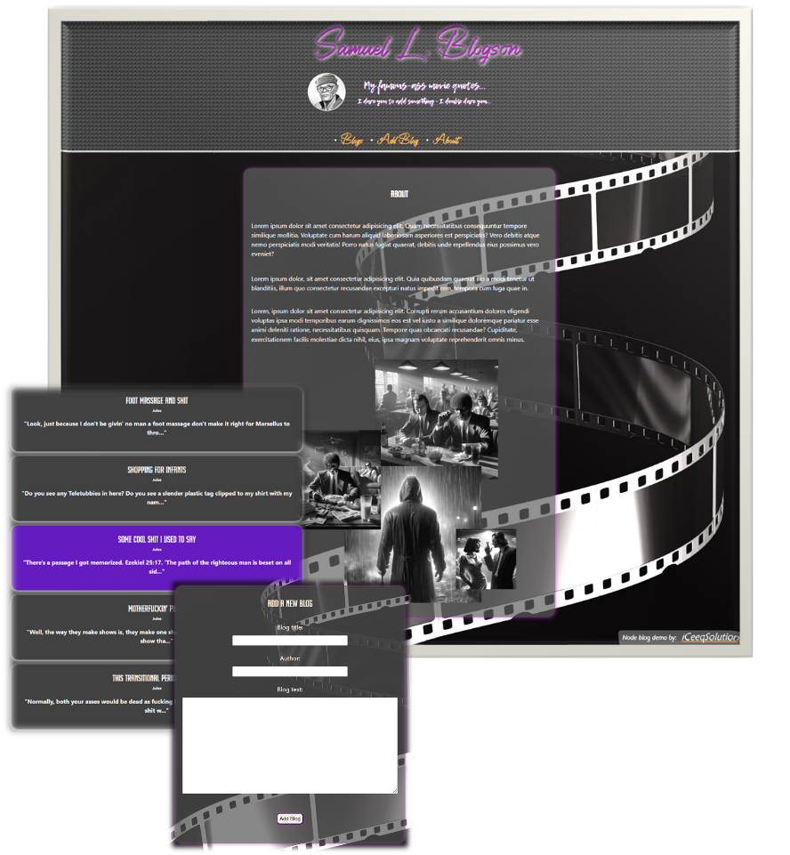

# Node/MongoDB Application - Movie Quotes Blog

  Node Blog Demo by <a href="https://iceeqsolutions.fi/">iCeeqSolutions</a>

## About

The Movie Quotes Blog is a Node demo project demonstrating the use of MVC structure, the possibility to connect to an external database (MongoDB) and the use of environment variables to allow database access without sharing the actual connection string.

In MongoDB, we've used triggers to schedule database resets. This way any inserts and deletions are visible only for a short period of time (5 minutes), before resetting the app to its original state. This in turn allows users to freely test the application without consequences.

## Demo

👁️ [Live Demo](https://iceeqsolutions-node-blog-demo.adaptable.app/blogs)

## Built with

- JavaScript (Node with ESM syntax)
- Express
- EJS
- CSS
- dotenv
- MongoDB
- Mongoose
- Prettier

## Features

- Database access with create, read and delete rights
- Responsive design
- Environment variables
- Asynchronous data fetching

  

  
